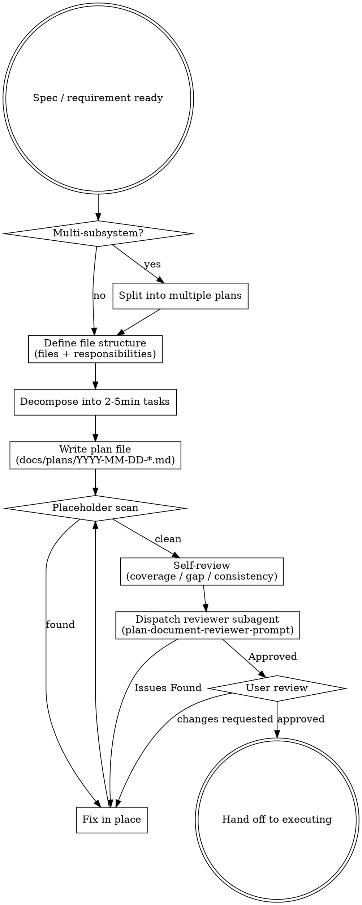

<SUBAGENT-STOP>
如果你是被派来执行特定任务的子代理, 跳过此 skill。任务已在主智能体拆好。
</SUBAGENT-STOP>

# 写实现计划

把需求拆成细碎任务计划, 让"零上下文、品味可疑的初级工程师"也能照做不出错。产出 `docs/plans/YYYY-MM-DD-<name>.md`。

<HARD-GATE>
计划禁止占位符。`TBD` / `添加验证` / `类似任务 N` / `参考上面` 全是失败。

每个任务必须有: 完整代码 + 具体文件路径 + 验证命令 + 预期输出。

任一缺 = 计划不及格, 扔了重写。
</HARD-GATE>

## 反模式: "这需求简单, 列几个步骤就行"

最常掉的坑。每次想"步骤够了, 不用每步贴代码"时, 就是该贴的时刻。

简单需求 = 你直觉能做, 不等于初级工程师能照做。计划的读者是没上下文的人, 不是你。

## 清单

按顺序完成:

1. **范围扫** — 多子系统? 拆多个计划 (见下文"范围检查")
2. **文件结构定** — 改哪些文件 + 各自责任边界 (见下文"文件结构")
3. **任务粒度** — 每任务 2-5 分钟可完成
4. **计划头部** — Goal / Architecture / Tech Stack
5. **任务结构** — Files + Steps(清单) + 代码 + 命令 + 验证
6. **占位符扫** — TBD / 模糊词 / "类似..." 全清
7. **自审** — 覆盖 / 缺口 / 类型一致
8. **派子代理评审** — 用 `plan-document-reviewer-prompt.md` 模板派评审子代理跑一遍
9. **交付** — 给用户审, 提示后续 (executing)

## 范围检查

写计划之前先判断: 需求是否涵盖多个独立子系统?

- **是** — 拆成多个计划, 每个子系统一个, 各自独立可运行 / 可测试
- **否** — 单计划继续

如果 think 阶段没拆, 这里就要补拆。每个计划都应能独立产出"可运行 + 可测试"的软件; 跨子系统耦合的计划会让任务边界模糊, 执行者难以独立验证。

## 文件结构

定义任务之前, 先梳理: **要创建 / 修改哪些文件, 每个文件的职责是什么**? 这是拆解决策被锁定的环节。

- **单一职责**: 每个文件承担一个明确职责, 边界清晰 + 接口定义良好
- **小而聚焦优于大而全**: 你对能一次容纳在上下文里的代码推理最佳; 文件聚焦时你的编辑更可靠。文件膨胀通常是它做太多事的信号
- **按职责拆分, 不按技术分层**: 一起变化的文件应放在一起
- **遵循既有模式**: 在已有代码库里不要单方面重组——但如果你正在动的文件已经难以维护, 把拆分纳入本次计划是合理的

这个结构指导任务拆解。每个任务都应产出"自包含 + 独立可理解"的变更。

## 流程图



## 计划文件模板

存储路径: `docs/plans/YYYY-MM-DD-<feature-name>.md`

````markdown
# <功能> 实现计划

**Goal:** 一句话目的
**Architecture:** 2-3 句架构说明
**Tech Stack:** 关键库 / 框架

---

### Task 1: <组件名>

**Files:**
- Create: `path/to/new.ts`
- Modify: `path/to/existing.ts:42-58`
- Test: `path/to/new.test.ts`

**Steps:**
- [ ] Step 1: 写失败测试
  ```ts
  test('xxx', () => { ... })  // 完整代码, 不是占位
  ```
  Run: `npm test new`
  Expected: `1 failed`

- [ ] Step 2: 实现让测试过
  ```ts
  export function xxx() { ... }
  ```
  Run: `npm test new`
  Expected: `1 passed`

- [ ] Step 3: 提交 (征得用户同意后)
  问用户: "Task N 完成 (改了 X, 测试 Y/Y pass). 现在 commit 吗?"
  授权后 Run: `git commit -m "feat: xxx"`

### Task 2: ...
````

## 任务粒度

| 粒度 | 判定 | 处理 |
|---|---|---|
| 2-5 分钟 | ✓ | 写 |
| < 2 分钟 | 太碎 | 合并到上下任务 |
| > 5 分钟 | 太大 | 拆成多任务 |

## TDD 风格 (推荐, 非强制)

任务模板默认每任务第 1 步是"写失败测试", 第 2 步实现。

**可删测试步骤的场景**:

- 写文档 / 改 README / 改注释
- 改配置 (CI / lint / tsconfig)
- 一次性脚本 (数据迁移 / 调研)
- UI 调样式 / 视觉微调
- POC / spike (验证可行性)

本仓**不计划补** TDD 强制 skill (见 README ROADMAP)。TDD 留在 plan 模板里作软推荐, 不适用场景自行删测试步骤。

## 占位符黑名单

出现 → 失败, 重写:

- `TBD` / `TODO` / `FIXME`
- `// ... 类似任务 N` / `// 参考上面`
- `// 实现 X` (不给代码)
- `// 验证 Y` (不给命令)
- `<placeholder>` / `<name>` 等模板占位
- 模糊动词: "处理" / "适配" / "完善" / "优化一下"

具体不出来 = 你没想清楚 = 工程师做不出来。

## 自审清单

写完计划自己过一遍:

- [ ] 每任务有 Files / Steps / 代码 / 命令 / 预期
- [ ] 占位符 0 个
- [ ] 文件路径全是精确 (不含变量)
- [ ] 命令可直接复制运行
- [ ] 任务顺序无依赖倒挂
- [ ] 规格 100% 覆盖

任一不通过 → 修, 再审。

## 交付

```
写好 → 自审通过 → 派评审子代理 → 修问题 → 给用户审
                                                  ↓ 用户批准
                                  提示后续: "用 executing skill 执行?"
```

**派评审子代理:** 用 `plan-document-reviewer-prompt.md` 模板派一个 general-purpose 子代理过计划, 返回 Approved / Issues。Issues 就地修, 修完即走 (不需再审一轮)。评审者是"第二双眼睛", 自审是"第一双眼睛", 两层叠加比单层抓得更全。

## 前后衔接 (软引用, 不强制)

- **前序**: 需求还没定 → 先走 think 跟用户对齐, 再回来写计划
- **后续**: executing 逐任务跑 (本仓默认路径)

头脑风暴 / 子代理驱动开发 / TDD 等更完整流程, 本仓**不计划补**(见 README ROADMAP), 自行扩展或另寻方案。

## 警示信号

| 内心戏 | 真相 |
|---|---|
| "这需求简单, 列几步就行" | 简单也得给代码, 否则 = 没拆 |
| "代码细节让执行者看着办" | 执行者没上下文, 你不写 = 它编 |
| "TBD 先占位, 后面再补" | TBD = 计划不完整 = 不能交付 |
| "用户应该懂这步什么意思" | 假设它懂 = 没写完 |
| "任务大点没事, 反正一个意思" | >5 分钟任务失败率指数上升 |
| "TDD 模板我懒得改, 留着算了" | 不适用场景留测试步骤 = 假测试糊弄 |

## 核心原则

- **HARD-GATE 不可破** — 占位符零容忍
- **细碎不可破** — 2-5 分钟硬约束
- **代码必给** — 任务步骤必须含完整代码
- **命令必给** — 每步骤验证方式具体
- **TDD 不强制** — 写文档 / 调样式不卡你
- **计划给别人读的** — 不是给自己回忆的
