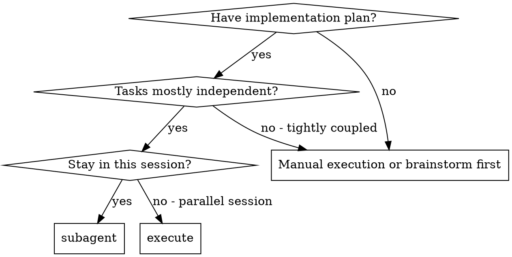
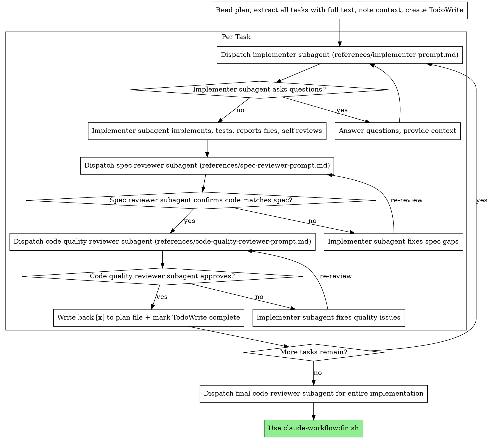

# 分任务执行方案

<HARD-GATE>
检查是否符合需求要先过，才能开始检查代码质量。顺序是：实现 → 检查是否符合需求 → 检查代码质量。

任何一轮检查还有没解决的问题时，不许进入下一个任务。
</HARD-GATE>

为每个任务分配一个新的独立代理来执行方案，每个任务做完后两轮检查：先看是否符合需求，再看代码质量。

**为什么要分任务给独立代理：** 你把任务交给有干净上下文的独立代理。通过精心准备它们的指令和上下文，确保它们专注于任务、做得好。它们不应该继承你会话的上下文或历史——你要刚好给够它们需要的信息。这同时也省下你自己的上下文用于统筹协调。

**持续执行：** 任务之间不要停下来向用户确认。一口气执行方案中所有任务。只在这些情况下停：你解决不了的卡住状态、确实阻碍进度的歧义，或者所有任务已完成。"我应该继续吗？"这种询问和进度汇总都浪费时间——用户让你执行方案，那就执行。

## 何时使用



**对比在另一个会话里执行方案：**
- 同一会话（不用切来切去）
- 每个任务分配新的独立代理（上下文不串）
- 每个任务做完后两轮检查：先看是否符合需求，再看代码质量
- 更快推进（任务之间不用等人确认）

## 流程



### 怎么记录进度

**进度以 plan 文件为准。** 任务列表只是当前会话的辅助，文件里的记录才算数。

**完成后怎么记录：** 每个任务的两轮检查都通过后，把该任务下所有 `- [ ]` 改为 `- [x]` 写回 plan 文件。验证失败时在步骤下追加 `  - ❌ failed: <错误信息>`。

**找方案文件：** 如果用户指定了路径，直接读取。如果没有指定，扫描 `docs/plans/` 目录，找包含 `- [ ]` 的文件。找到多个时列出让用户选择。

**之前做了一半怎么办：** 读 plan 文件时，如果已有 `- [x]` 步骤，说明之前中断过。汇报已完成的步骤数，从第一个 `- [ ]` 的任务继续。

### 选模型

每个角色用能胜任的最便宜模型，省钱也快。

**简单实现**（独立的函数、需求写得清楚、1-2 个文件）：用快、便宜的模型。方案写得够细时，大多数实现任务都是简单的。

**需要协调的任务**（多文件配合、模式匹配、调试）：用标准模型。

**架构、设计和检查**：用最强的模型。

**怎么判断复杂度：**
- 涉及 1-2 个文件且需求完整 → 便宜模型
- 涉及多个文件、有配合问题 → 标准模型
- 需要设计判断或对代码库整体理解 → 最强模型

### 处理执行代理的反馈

执行任务的代理会汇报四种状态之一。分别这样处理：

**DONE：** 进入"检查是否符合需求"。

**DONE_WITH_CONCERNS：** 做完了但提出了疑虑。先看看这些疑虑。如果涉及正确性或范围，先解决再检查。如果只是随口一提（例如"这个文件越来越大了"），记下来然后进入检查。

**NEEDS_CONTEXT：** 需要你没给够的信息。补全缺的内容后重新分配。

**BLOCKED：** 做不下去了。看看为什么卡住：
1. 如果是信息不够，补充更多上下文并用相同模型重新分配
2. 如果任务需要更强推理能力，用更强的模型重新分配
3. 如果任务太大，拆成更小的部分
4. 如果方案本身有问题，交给用户决定

**绝不**在什么都不改的情况下让同一个模型再试一次。如果代理说卡住了，就一定有什么需要调整。

### 提示词模板

- `references/implementer-prompt.md` - 分配执行任务的代理
- `references/spec-reviewer-prompt.md` - 分配检查需求符合度的代理
- `references/code-quality-reviewer-prompt.md` - 分配检查代码质量的代理

通过 Claude Code 的 `Agent` 工具分配这些 subagent。不要使用旧称 `Task tool`。

subagent 不得默认提交、push 或创建 PR。只有用户或已批准方案明确要求提交时，才把提交动作写进分配的提示词。

### 示例工作流

```
You: I'm using Subagent-Driven Development to execute this plan.

[Read plan file once: docs/plans/feature-plan.md]
[Extract all 5 tasks with full text and context]
[Create TodoWrite with all tasks]

Task 1: Hook installation script

[Get Task 1 text and context (already extracted)]
[Dispatch implementation subagent with full task text + context]

Implementer: "Before I begin - should the hook be installed at user or system level?"

You: "User level (~/.config/claude-workflow/hooks/)"

Implementer: "Got it. Implementing now..."
[Later] Implementer:
  - Implemented install-hook command
  - Added tests, 5/5 passing
  - Self-review: Found I missed --force flag, added it

[Dispatch spec compliance reviewer]
Spec reviewer: ✅ Spec compliant - all requirements met, nothing extra

[Get git SHAs, dispatch code quality reviewer]
Code reviewer: Strengths: Good test coverage, clean. Issues: None. Approved.

[Mark Task 1 complete]

Task 2: Recovery modes

[Get Task 2 text and context (already extracted)]
[Dispatch implementation subagent with full task text + context]

Implementer: [No questions, proceeds]
Implementer:
  - Added verify/repair modes
  - 8/8 tests passing
  - Self-review: All good

[Dispatch spec compliance reviewer]
Spec reviewer: ❌ Issues:
  - Missing: Progress reporting (spec says "report every 100 items")
  - Extra: Added --json flag (not requested)

[Implementer fixes issues]
Implementer: Removed --json flag, added progress reporting

[Spec reviewer reviews again]
Spec reviewer: ✅ Spec compliant now

[Dispatch code quality reviewer]
Code reviewer: Strengths: Solid. Issues (Important): Magic number (100)

[Implementer fixes]
Implementer: Extracted PROGRESS_INTERVAL constant

[Code reviewer reviews again]
Code reviewer: ✅ Approved

[Mark Task 2 complete]

...

[After all tasks]
[Dispatch final code-reviewer]
Final reviewer: All requirements met, ready to merge

Done!
```

<constraints>
- 没有用户明确同意不许在 main/master 分支上动手
- 不许跳过任何一轮检查（需求符合度或代码质量）
- 有没修好的问题不许做下一个任务
- 不许同时分配多个执行代理（会冲突）
- 不许让 subagent 自己去读方案文件（必须把完整文本给它）
- 不许跳过场景说明和上下文
- 不许无视 subagent 的提问
- 需求符合度检查不许"差不多就行"
- 不许跳过"检查、发现问题、修、再检查"这个循环
- 不许拿执行代理的自查代替独立检查
- 需求符合度检查没过不许开始代码质量检查
- 任何一轮检查有没解决的问题就不许做下一个任务
- 不许在什么都不改的情况下让同一个模型重试卡住的任务
- 不许只更新任务列表而不把进度写回 plan 文件——进度以 plan 文件为准
</constraints>

## 警示信号

| 念头 | 现实 |
|------|------|
| "这个任务简单，跳过检查" | 简单任务也会偏离需求 |
| "执行代理自己查过了，够了" | 自查 ≠ 独立检查，两个都要 |
| "差不多符合需求了" | 检查发现问题 = 没完成 |
| "先查代码质量再查需求" | 顺序错了，需求优先 |
| "代理卡住了，再试一次" | 什么都不改就重试 = 浪费 |
| "手动修一下比分配代理快" | 手动修 = 上下文串了 |

## 优势

**对比手动执行：**
- 独立代理自然遵循 TDD
- 每个任务有干净上下文（不串）
- 不会互相干扰
- 代理可以提问（开始前和做的过程中都行）

**对比在另一个会话里执行方案：**
- 同一会话（不用来回切）
- 持续推进（不用等人）
- 检查自动进行

**成本：**
- 更多代理调用（每个任务一个执行 + 两个检查）
- 你要提前做更多准备（把所有任务信息抽好）
- 检查修改、再检查会增加迭代次数
- 但能尽早发现问题（比后期调试便宜）

## 集成

**必需的工作流技能：**
- **claude-workflow:worktree** - 确保有隔离的工作空间（创建一个或确认已有的）
- **claude-workflow:plan** - 创建本技能要执行的方案
- **claude-workflow:review** - 检查代理使用的代码检查模板
- **claude-workflow:finish** - 所有任务做完后收尾

**subagent 应使用：**
- **claude-workflow:test** - 对每个任务遵循 TDD

**备选工作流：**
- **claude-workflow:execute** - 在另一个会话里执行，而不是在当前会话

## 沟通规范
- 用户看不到工具调用和思考过程，只看到你的文字输出
- 回复中不要出现本文件里的流程术语（不说"门控"、"检查点"、"子代理"、"回写"、"评审循环"）
- 用日常口语描述你在做什么："我先看看代码" / "写好了，测试通过" / "有个问题需要你确认"
- 匹配用户的说话风格——用户简短你就简短，用户详细你就详细
