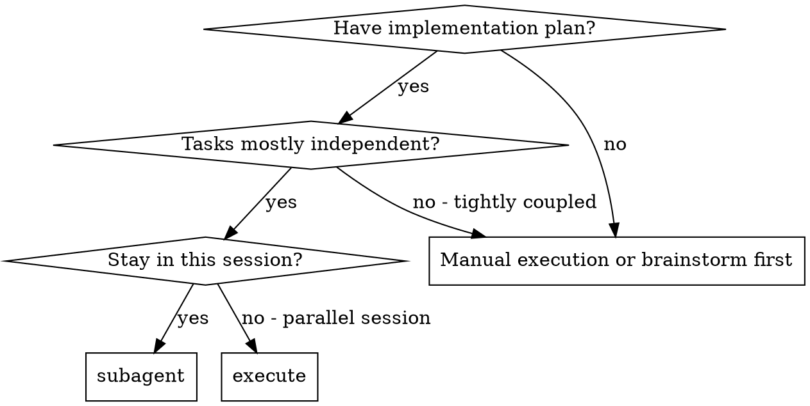
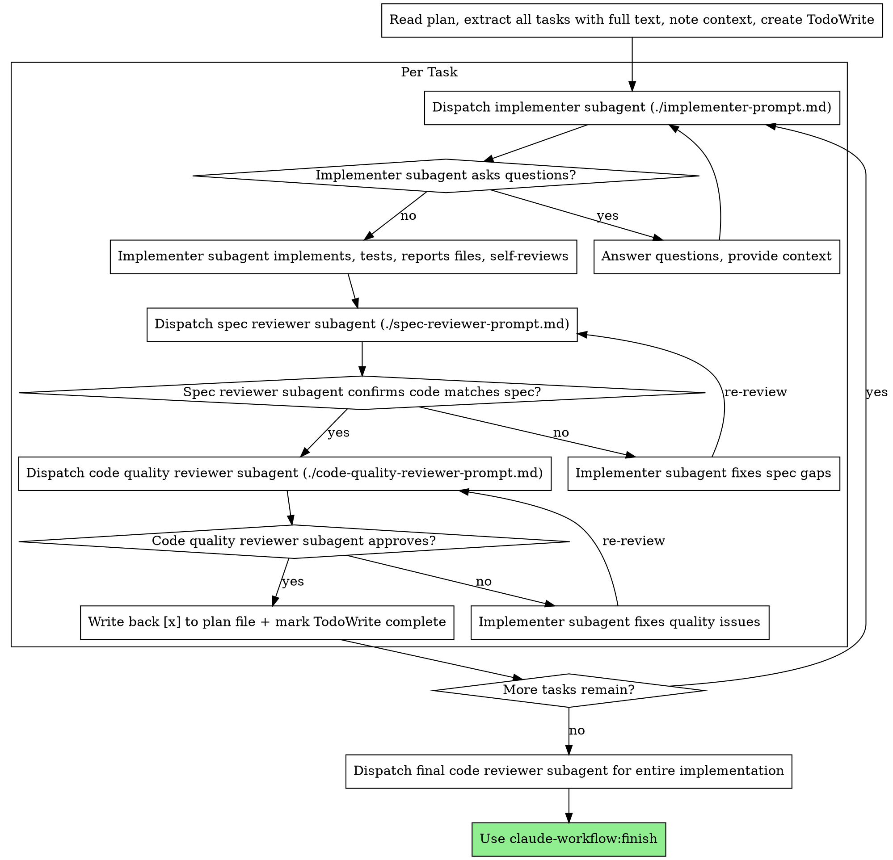

# 子代理驱动开发

<HARD-GATE>
规格符合性评审通过之前，不得开始代码质量评审。顺序是：实现 → 规格评审 → 代码质量评审。

在任一评审还有未解决问题时，不得进入下一个任务。
</HARD-GATE>

通过为每个任务派发新的子代理来执行方案，每个任务完成后进行两阶段评审：先做规格符合性评审，再做代码质量评审。

**为什么用子代理：** 你将任务委派给具备隔离上下文的专门代理。通过精心构造它们的指令和上下文，确保它们专注于任务并取得成功。它们绝不应该继承你会话的上下文或历史——你要恰到好处地为它们构造所需内容。这同时也保留了你自己的上下文用于协调工作。

**持续执行：** 在任务之间不要停下来向用户确认。不停顿地执行方案中所有任务。仅在以下情况下停止：你无法解决的 BLOCKED 状态、确实阻碍进度的歧义，或所有任务已完成。"我应该继续吗？"的询问和进度汇总都浪费时间——用户让你执行方案，那就执行。

## 何时使用



**对比执行方案（并行会话）：**
- 同一会话（无上下文切换）
- 每个任务派发新子代理（无上下文污染）
- 每个任务后两阶段评审：先规格符合性，再代码质量
- 更快迭代（任务之间无需人在回路中）

## 流程



### 进度持久化

**plan 文件是进度的唯一真相来源。** TodoWrite 仅作会话内进度显示，丢失不影响恢复。

**回写规则：** 每个任务的评审循环全部通过后，把该任务下所有 `- [ ]` 改为 `- [x]` 写回 plan 文件。验证失败时在步骤下追加 `  - ❌ failed: <错误信息>`。

**定位方案文件：** 如果用户指定了路径，直接读取。如果没有指定，扫描 `docs/plans/` 目录，找包含 `- [ ]` 的文件。找到多个时列出让用户选择。

**中断恢复：** 载入 plan 文件时，如果已有 `- [x]` 步骤，说明是恢复场景。汇报已完成的步骤数，从第一个 `- [ ]` 的任务继续。

### 模型选择

为每个角色使用能够胜任的最低能力模型，以节约成本并提升速度。

**机械式实现任务**（孤立的函数、规格清晰、1-2 个文件）：使用快速、便宜的模型。当方案规格充分时，大多数实现任务都是机械式的。

**集成与判断任务**（多文件协调、模式匹配、调试）：使用标准模型。

**架构、设计与评审任务**：使用能力最强的可用模型。

**任务复杂度信号：**
- 涉及 1-2 个文件且有完整规格 → 便宜模型
- 涉及多个文件且存在集成顾虑 → 标准模型
- 需要设计判断或广泛理解代码库 → 最强能力模型

### 处理实现者状态

实现者子代理会汇报四种状态之一。分别采取合适的处理：

**DONE：** 进入规格符合性评审。

**DONE_WITH_CONCERNS：** 实现者完成了工作但提出了疑虑。在继续之前阅读这些疑虑。如果疑虑涉及正确性或范围，先解决再评审。如果只是观察（例如"这个文件越来越大"），记下并进入评审。

**NEEDS_CONTEXT：** 实现者需要未提供的信息。补全缺失上下文后重新派发。

**BLOCKED：** 实现者无法完成任务。评估阻塞原因：
1. 如果是上下文问题，补充更多上下文并用相同模型重新派发
2. 如果任务需要更强推理能力，用更强大的模型重新派发
3. 如果任务过大，拆分成更小的部分
4. 如果方案本身有误，升级到人类

**绝不**在不做任何改变的情况下忽视升级或强制让相同模型重试。如果实现者说卡住了，就一定有什么需要调整。

### 提示词模板

- `./implementer-prompt.md` - 派发实现者子代理
- `./spec-reviewer-prompt.md` - 派发规格符合性评审员子代理
- `./code-quality-reviewer-prompt.md` - 派发代码质量评审员子代理

通过 Claude Code 的 `Agent` 工具派发这些子代理。不要使用旧称 `Task tool`。

子代理不得默认提交、push 或创建 PR。只有用户或已批准方案明确要求提交时，才把提交动作写进派发提示词。

### 示例工作流

```
You: I'm using Subagent-Driven Development to execute this plan.

[Read plan file once: docs/plans/feature-plan.md]
[Extract all 5 tasks with full text and context]
[Create TodoWrite with all tasks]

Task 1: Hook installation script

[Get Task 1 text and context (already extracted)]
[Dispatch implementation subagent with full task text + context]

Implementer: "Before I begin - should the hook be installed at user or system level?"

You: "User level (~/.config/claude-workflow/hooks/)"

Implementer: "Got it. Implementing now..."
[Later] Implementer:
  - Implemented install-hook command
  - Added tests, 5/5 passing
  - Self-review: Found I missed --force flag, added it

[Dispatch spec compliance reviewer]
Spec reviewer: ✅ Spec compliant - all requirements met, nothing extra

[Get git SHAs, dispatch code quality reviewer]
Code reviewer: Strengths: Good test coverage, clean. Issues: None. Approved.

[Mark Task 1 complete]

Task 2: Recovery modes

[Get Task 2 text and context (already extracted)]
[Dispatch implementation subagent with full task text + context]

Implementer: [No questions, proceeds]
Implementer:
  - Added verify/repair modes
  - 8/8 tests passing
  - Self-review: All good

[Dispatch spec compliance reviewer]
Spec reviewer: ❌ Issues:
  - Missing: Progress reporting (spec says "report every 100 items")
  - Extra: Added --json flag (not requested)

[Implementer fixes issues]
Implementer: Removed --json flag, added progress reporting

[Spec reviewer reviews again]
Spec reviewer: ✅ Spec compliant now

[Dispatch code quality reviewer]
Code reviewer: Strengths: Solid. Issues (Important): Magic number (100)

[Implementer fixes]
Implementer: Extracted PROGRESS_INTERVAL constant

[Code reviewer reviews again]
Code reviewer: ✅ Approved

[Mark Task 2 complete]

...

[After all tasks]
[Dispatch final code-reviewer]
Final reviewer: All requirements met, ready to merge

Done!
```

<constraints>
- 禁止未经用户明确同意就在 main/master 分支上开始实现
- 禁止跳过评审（规格符合性或代码质量）
- 禁止带着未修复的问题继续下一任务
- 禁止并行派发多个实现者子代理（会冲突）
- 禁止让子代理读取方案文件（必须提供完整文本）
- 禁止跳过场景说明上下文
- 禁止忽视子代理提问
- 禁止在规格符合性上接受"差不多就行"
- 禁止跳过评审循环（评审员发现问题 = 实现者修复 = 再次评审）
- 禁止让实现者的自评审取代真正的评审
- 禁止在规格符合性通过之前开始代码质量评审
- 禁止在任一评审有未解决问题时进入下一任务
- 禁止在不做任何改变的情况下强制让相同模型重试 BLOCKED 任务
- 禁止只更新 TodoWrite 而不回写 plan 文件——plan 文件是唯一真相来源
</constraints>

## 警示信号

| 念头 | 现实 |
|------|------|
| "这个任务简单，跳过评审" | 简单任务也会有规格偏差 |
| "实现者自评审过了，够了" | 自评审 ≠ 独立评审，两者都需要 |
| "差不多符合规格了" | 规格评审员发现问题 = 未完成 |
| "先做质量评审再做规格评审" | 顺序错误，规格优先 |
| "子代理卡住了，再试一次" | 不改变任何东西就重试 = 浪费 |
| "手动修一下比派子代理快" | 手动修复 = 上下文污染 |

## 优势

**对比手动执行：**
- 子代理自然遵循 TDD
- 每个任务有新鲜上下文（不混淆）
- 并行安全（子代理之间不互相干扰）
- 子代理可以提问（开始前与工作中皆可）

**对比执行方案：**
- 同一会话（无交接）
- 持续推进（无等待）
- 评审检查点自动进行

**成本：**
- 更多子代理调用（每个任务实现者 + 2 个评审员）
- 控制器需做更多准备工作（提前抽取所有任务）
- 评审循环增加迭代次数
- 但能尽早发现问题（比后期调试便宜）

## 集成

**必需的工作流技能：**
- **claude-workflow:worktree** - 确保隔离的工作空间（创建一个或验证已存在的）
- **claude-workflow:plan** - 创建本技能执行的方案
- **claude-workflow:review** - 评审员子代理使用的代码评审模板
- **claude-workflow:finish** - 在所有任务完成后收尾开发

**子代理应使用：**
- **claude-workflow:test** - 子代理对每个任务遵循 TDD

**备选工作流：**
- **claude-workflow:execute** - 用于并行会话而非同会话执行
