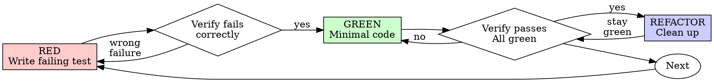

# 测试驱动开发（TDD）

<HARD-GATE>
没有先失败的测试，就没有任何生产代码。

在测试之前写了代码？删掉它。重新开始。没有例外：别把它留作"参考"，别在写测试时"改造"它，别去看它。删除就是删除。从测试出发，重新实现。
</HARD-GATE>

先写测试。看着它失败。再写最少的代码让它通过。如果你没有亲眼看到测试失败，你就不知道它测的是不是正确的东西。违反规则的字面含义就是违反规则的精神。

## 何时使用

**始终使用：**
- 新功能
- 缺陷修复
- 重构
- 行为变更

**例外情况（请询问用户）：**
- 一次性原型
- 生成的代码
- 配置文件

在想"这次就跳过 TDD 吧"？停下。那是自我合理化。

## 流程

### 红-绿-重构



### RED - 写一个失败的测试

写一个最小的测试，表达应该发生什么。

<Good>
```typescript
test('retries failed operations 3 times', async () => {
  let attempts = 0;
  const operation = () => {
    attempts++;
    if (attempts < 3) throw new Error('fail');
    return 'success';
  };

  const result = await retryOperation(operation);

  expect(result).toBe('success');
  expect(attempts).toBe(3);
});
```
名称清晰，测试真实行为，只测一件事
</Good>

<Bad>
```typescript
test('retry works', async () => {
  const mock = jest.fn()
    .mockRejectedValueOnce(new Error())
    .mockRejectedValueOnce(new Error())
    .mockResolvedValueOnce('success');
  await retryOperation(mock);
  expect(mock).toHaveBeenCalledTimes(3);
});
```
名称含糊，测的是 mock 而不是代码
</Bad>

**要求：**
- 一个行为
- 名称清晰
- 真实代码（除非不可避免，否则不要用 mock）

### 验证 RED - 看它失败

**强制要求。绝不跳过。**

```bash
npm test path/to/test.test.ts
```

确认：
- 测试失败（而不是报错）
- 失败信息符合预期
- 失败是因为功能缺失（而不是拼写错误）

**测试通过了？** 那你测的是已有行为。修正测试。

**测试报错？** 修正错误，重跑直到它以正确方式失败。

### GREEN - 最少代码

写最简单的代码让测试通过。

<Good>
```typescript
async function retryOperation<T>(fn: () => Promise<T>): Promise<T> {
  for (let i = 0; i < 3; i++) {
    try {
      return await fn();
    } catch (e) {
      if (i === 2) throw e;
    }
  }
  throw new Error('unreachable');
}
```
刚好够通过测试
</Good>

<Bad>
```typescript
async function retryOperation<T>(
  fn: () => Promise<T>,
  options?: {
    maxRetries?: number;
    backoff?: 'linear' | 'exponential';
    onRetry?: (attempt: number) => void;
  }
): Promise<T> {
  // YAGNI
}
```
过度设计
</Bad>

不要加功能、不要重构其他代码、不要超出测试做"改进"。

### 验证 GREEN - 看它通过

**强制要求。**

```bash
npm test path/to/test.test.ts
```

确认：
- 测试通过
- 其他测试仍然通过
- 输出干净（没有 error、warning）

**测试失败？** 修代码，不是修测试。

**其他测试失败？** 立即修。

### REFACTOR - 清理

仅在通过之后：
- 移除重复
- 改进命名
- 抽取辅助函数

保持测试为绿色。不要新增行为。

### 重复

为下一个功能写下一个失败的测试。

## 好的测试

| 特质 | 好 | 差 |
|---------|------|-----|
| **最小** | 一件事。名字里有"and"？拆开。 | `test('validates email and domain and whitespace')` |
| **清晰** | 名字描述行为 | `test('test1')` |
| **体现意图** | 展示期望的 API | 模糊代码应该做什么 |

## 顺序为何重要

**"我会在事后写测试来验证它工作正常"**

代码之后写的测试会立即通过。立即通过证明不了任何事：
- 可能测的是错的东西
- 可能测的是实现，不是行为
- 可能漏掉你忘记的边界情况
- 你从未见过它捕获 bug

测试先行强制你看到测试失败，证明它确实在测某些东西。

**"我已经手动测过所有边界情况了"**

手动测试是临时性的。你以为测了所有情况，但是：
- 没有测过什么的记录
- 代码变更时无法重跑
- 压力下容易遗漏情况
- "我试的时候能用" ≠ 全面

自动化测试是系统性的。每次都以同样方式运行。

**"删掉 X 个小时的工作太浪费"**

沉没成本谬误。时间已经过去。你现在的选择：
- 删掉并以 TDD 重写（再花 X 小时，高信心）
- 留着它并事后补测试（30 分钟，低信心，很可能有 bug）

"浪费"的是留着你信不过的代码。没有真实测试的工作代码就是技术债。

**"TDD 是教条，务实意味着灵活变通"**

TDD 本身就是务实的：
- 在提交前发现 bug（比之后调试更快）
- 防止回归（测试立刻捕获破坏）
- 文档化行为（测试展示如何使用代码）
- 让重构可行（自由改动，测试捕获破坏）

"务实"的捷径 = 在生产环境调试 = 更慢。

**"事后测试达成相同目标 — 关键是精神不是仪式"**

不。事后测试回答的是"它做了什么？"事前测试回答的是"它应该做什么？"

事后测试会受你的实现偏置。你测的是你建好的东西，不是被要求的东西。你验证的是你记得的边界情况，不是你发现的边界情况。

事前测试强迫你在实现之前发现边界情况。事后测试只能验证你是否记住了一切（你没有）。

事后写 30 分钟测试 ≠ TDD。你拿到了覆盖率，丢掉了"测试确实在工作"的证明。

## 验证清单

在标记工作完成之前：

- [ ] 每个新函数/方法都有测试
- [ ] 在实现之前看到每个测试失败
- [ ] 每个测试都因预期原因失败（功能缺失，不是拼写错）
- [ ] 写了最少的代码让每个测试通过
- [ ] 所有测试通过
- [ ] 输出干净（无 error、warning）
- [ ] 测试使用真实代码（仅在不可避免时用 mock）
- [ ] 覆盖了边界情况与错误

无法勾选所有项？说明你跳过了 TDD。重新开始。

## 卡住的时候

| 问题 | 解决方案 |
|---------|----------|
| 不知道怎么测 | 写下期望中的 API。先写断言。问用户。 |
| 测试过于复杂 | 设计过于复杂。简化接口。 |
| 不得不到处都用 mock | 代码耦合过紧。使用依赖注入。 |
| 测试 setup 很大 | 抽取辅助函数。仍然复杂？简化设计。 |

## 示例：缺陷修复

**缺陷：** 空邮箱被接受

**RED**
```typescript
test('rejects empty email', async () => {
  const result = await submitForm({ email: '' });
  expect(result.error).toBe('Email required');
});
```

**验证 RED**
```bash
$ npm test
FAIL: expected 'Email required', got undefined
```

**GREEN**
```typescript
function submitForm(data: FormData) {
  if (!data.email?.trim()) {
    return { error: 'Email required' };
  }
  // ...
}
```

**验证 GREEN**
```bash
$ npm test
PASS
```

**REFACTOR**
若需要，抽取出多字段的校验。

<constraints>
- 禁止在测试之前写生产代码
- 禁止跳过验证 RED 步骤（必须亲眼看到测试失败）
- 禁止把先写的代码"留作参考"或"改造"
- 禁止用 mock 代替真实代码（除非不可避免）
- 禁止在 GREEN 阶段加额外功能
- 禁止修测试来适应代码（应该修代码来通过测试）
- 禁止在没有测试的情况下修复 bug
</constraints>

## 警示信号

| 借口 | 现实 |
|--------|---------|
| "太简单不用测" | 简单代码也会坏。测试只要 30 秒。 |
| "我会事后测" | 立即通过的测试什么都证明不了。 |
| "事后测试达成相同目标" | 事后 = "它做了什么？" 事前 = "它应该做什么？" |
| "我已经手动测过了" | 临时 ≠ 系统。无记录、不能重跑。 |
| "删掉 X 小时太浪费" | 沉没成本谬误。留着未经验证的代码就是技术债。 |
| "留作参考，先写测试" | 你会改造它。那就是事后测试。删除就是删除。 |
| "需要先探索" | 可以。丢掉探索代码，再以 TDD 开始。 |
| "难测 = 设计不清" | 听测试的话。难测 = 难用。 |
| "TDD 会拖慢我" | TDD 比调试更快。务实 = 测试先行。 |
| "手动测更快" | 手动测不能证明边界情况。每次改动你都得重测。 |
| "现有代码没有测试" | 你正在改进它。给现有代码加测试。 |
| "就这一次" | 自我合理化。删掉代码，以 TDD 重新开始。 |
| "这次不一样，因为……" | 自我合理化。删掉代码，以 TDD 重新开始。 |

## 集成

- **claude-workflow:debug** —— 发现 bug 时，写一个能复现它的失败测试，走 TDD 流程
- **claude-workflow:verify** —— 在标记完成之前验证所有测试通过
