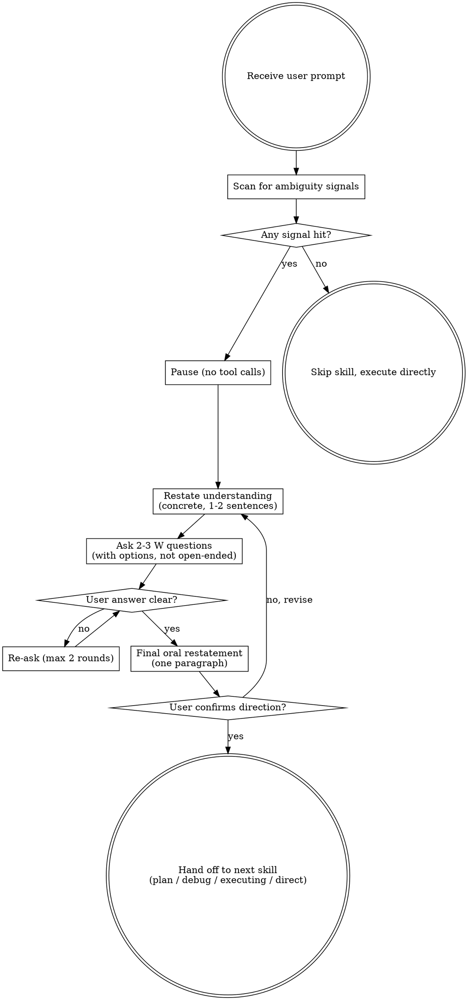

# 把模糊 prompt 打磨成对齐意图

用自然的协作对话，把"看下""改改""处理一下"这类多解读的请求，打磨成具体、可执行、用户确认过的任务描述。

先扫描歧义信号，命中即停手。一次提一个 W 问题，给选项不给开放题。一旦你明白要做什么，先复述确认，再开始动作。

<HARD-GATE>
检测到 prompt 模糊时，**禁止**调用任何工具（Read / Edit / Bash / Skill 等），**禁止**做任何"先看一下""先试一下"的探索性动作。

必须先完成：复述理解 → 提 W 问题 → 等用户确认。确认后才能进入执行。

这条规则适用于每一个模糊请求，无论它看上去多简单。"先快速看一下"不是例外，是违规。
</HARD-GATE>

## 反模式："这个简单不用对齐"

每个模糊请求都要走这套流程。一行配置、一个小重构、一处文案改动——全都要走。"简单"的模糊请求恰恰是未经审视的假设造成最多无效工作的地方。对齐可以很短（真正简单的请求一句话复述就够），但你必须复述并拿到确认。

模糊 prompt 没有简单的——简单的都是清晰的（具体文件 + 具体动作）。"看下""改改""处理一下"全都不简单——它们藏了多个可能的执行路径，选错就白干。

## 清单

你必须为下列每一项创建一个任务，并按顺序完成：

1. **扫歧义** —— 静默扫 prompt，看是否命中歧义信号（见下表）
2. **暂停** —— 命中即停，不调任何工具
3. **复述** —— 1-2 句具体复述你的理解，不空泛
4. **提问** —— 挑 2-3 个最相关的 W 问题，**给选项**
5. **等确认** —— 用户回答清晰后才执行
6. **收尾对齐** —— 口头复述确认结果（一段话即可），让用户拍板"方向对不对"
7. **过渡** —— 用户拍板后，按任务类型调对应的下一个 skill（见下文）

> **不要写任务描述文档。** 任务拆解、文件路径、验证命令、TDD 步骤是 `plan` skill 的活。think 的产出**只是口头对齐过的方向**，不落盘、不写五字段模板。要落文档就交给 `plan`。

## 流程图

**终止状态是过渡到下一个 skill。** 不要在本 skill 内直接写代码、跑命令、改文件。对齐完成之后唯一可以做的事是调用下一个合适的 skill（见下文过渡表）。

## 详细流程

**扫歧义信号：**

收到 prompt 后第一件事是静默扫描，任一命中即触发本 skill。

| 信号 | 例子 |
|---|---|
| 指代不明 | "这块" / "那个" / "处理一下" / "改改" |
| 范围模糊 | "看下" / "做个 X" 没说边界 |
| 多解读 | 至少能想出 2 个合理理解 |
| 高代价决策 | 删除 / 重命名 / 改架构 / 改公共 API |
| 复合动词 | "重构 + 优化" / "改造 + 文档化" |

都不命中 → 跳过本 skill，直接执行。

**复述理解：**

复述要**具体**，不能空泛。空泛 = 没真理解 = 白对齐。

- ❌ "你想优化代码"
- ✓ "你想把 src/api.ts 的同步 fetch 改成异步，但保持调用点不变"

复述要点：带上文件名、函数名、约束条件、不要做的事。复述能让用户立刻发现你跑偏的方向。

**提 W 问题：**

挑跟当前歧义最相关的 **2-3 个**，**给选项**，不要纯开放式：

| W | 问什么 |
|---|---|
| What | 具体要做什么？（动作 / 产出） |
| Why | 目的是啥？（问题 / 业务驱动） |
| Where | 范围在哪？（文件 / 模块） |
| Who | 给谁用？（受众 / 调用方） |
| When | 优先级 / 截止？ |
| How | 方式偏好？（技术 / 风格） |
| Not | 明确**不**要什么？ |

- ❌ "你想要什么？"
- ✓ "你想 A：全部重写，还是 B：只改 X，还是 C：加个新文件？"

每条消息只问一个话题——话题需要更多探索时，就拆成多条问题，一次一个。

**等确认时的处理：**

- 回答**清晰** → 进入摘要落地
- 回答**仍模糊** → 再问 1 轮（最多 2 轮）
- 用户说**"按你想的"** → 给最可能的具体方案，问"是这个吗"，**不擅自决定**
- 死磕 2 轮仍模糊 → 让用户重新表达整个请求

**对齐边界：**

- 把请求拆成更小的单元，每个单元只有一个明确目标
- 每个单元都应能回答：要做什么、改哪些文件、怎么验证成功？
- 别人不读你的解释就能知道这个任务做什么吗？
- 如果不能，说明边界划得还不够清——继续追问

## 对齐完成之后

**收尾对齐（口头复述 + 用户拍板）：**

W 问题轮次结束、答案清晰后，做一次**口头**收尾复述（一段话，不落盘、不带模板字段），让用户拍板方向：

> "我理解你要做的是：<一句话动作> + <具体范围> + <不做什么>。方向对不对？"

等用户回复。要求改动就回到"复述 → 提问"再跑一轮。用户拍板后才能过渡。

**不要写任务描述文档。** think 不产出 `docs/...md`，不写"任务/范围/目的/不做/验证"五字段模板。这些是 `plan` skill 的产物，think 写就是越界。

**过渡到下一个 skill：**

按任务类型调对应 skill，**不要在本 skill 内动手**：

| 任务类型 | 下一步 skill |
|---|---|
| 多步骤实现 / 改多个文件 | `plan`（写实现计划，落 `docs/plans/...md`） |
| 排查 bug / 失败原因 | `debug`（系统化排查） |
| 已有计划，本次执行 | `executing`（按计划执行） |
| 单步小改动（1 个文件、几行） | 直接执行，无需再调 skill |

## 关键原则

- **一次一个问题** —— 别用一堆问题压垮人
- **优先选择题** —— 比开放题更容易回答
- **复述要具体** —— 带文件名、函数名、约束条件
- **最多 2 轮追问** —— 死磕不行，让用户重新表达
- **不擅自决定** —— "按你想的"也要先讲方案再问
- **HARD-GATE 不可破** —— 没有"先快速看一下"的例外

## 警示信号

以下念头意味着停下——你正在自我合理化：

| 念头 | 现实 |
|---------|---------|
| "用户大概是想 X" | 大概 ≠ 确定。先确认。 |
| "我先 ls / Read 看下再决定" | 工具调用违反 HARD-GATE。先停。 |
| "这事简单不用对齐" | 简单的事更容易做错方向。 |
| "上次他都这么做" | 上次 ≠ 这次。每次独立判断。 |
| "我先试一种，错了再改" | "试" = 工具调用 = 违规。 |
| "问太多用户会烦" | 问 2-3 个 30 秒，做错方向 1 小时。 |
| "他说'对齐意图'就是让我别问" | 不，是让你**用**这套对齐流程。 |
| "我已经理解了" | 没复述出来就是没理解。 |
| "复杂度太高不可能拆" | 拆不动就是范围没界定，继续问。 |
| "用户的话很清楚" | 你能想出 2 个解读就是不清楚。 |

## 何时不激活

满足以下任一 → 跳过 think：

- prompt 自带具体文件 / 函数 / 行号
- 重复性命令（`npm test` / `git status` / 格式化）
- 用户明确说"快速试一下 / 不用对齐"
- 子代理任务（任务已由主智能体拆好）
- 事实查询（"这函数返回什么？"）
- 用户已在 PlanMode 后审过计划，进入执行阶段
- 用户原话已包含完整的 What + Where + Why
