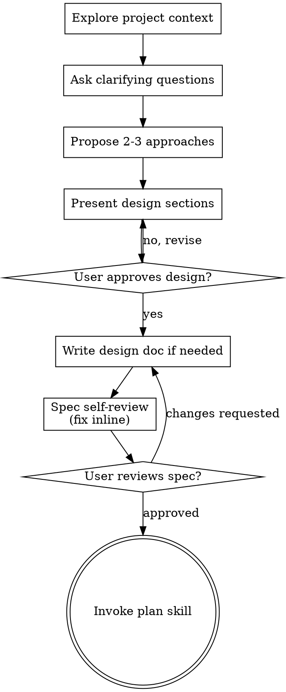

# 把创意打磨成设计的头脑风暴

通过自然的协作对话，帮助把想法转化为完整成形的设计与规格说明。

先理解当前项目上下文，然后每次提一个问题来打磨想法。一旦你明白要造什么，先呈现设计并获得用户批准。

<HARD-GATE>
在你已经呈现设计且用户已批准之前，不得调用任何实现类技能、不得写任何代码、不得搭建任何项目脚手架、不得采取任何实现动作。这条规则适用于每一个项目，无论它看上去多简单。
</HARD-GATE>

## 反模式："这太简单了不需要设计"

每个项目都要走这套流程。一个待办清单、一个单函数小工具、一处配置改动——全都要走。"简单"的项目恰恰是未经审视的假设造成最多无效工作的地方。设计可以很短（真正简单的项目几句话就够），但你必须呈现它并获得批准。

## 清单

你必须为下列每一项创建一个任务，并按顺序完成：

1. **探索项目上下文** —— 查看文件、文档、近期提交
2. **提出澄清问题** —— 一次一个，理解目的/约束/成功标准
3. **提出 2-3 种方案** —— 附权衡分析与你的推荐
4. **呈现设计** —— 按各部分复杂度伸缩长度，每呈现一节就获取用户批准
5. **必要时写出设计文档** —— 复杂或高风险改动保存到 `docs/specs/YYYY-MM-DD-<topic>-design.md`；简单改动保留对话中的短设计即可
6. **规格自审** —— 快速内联检查是否有占位符、矛盾、歧义、范围问题（见下文）
7. **用户评审规格** —— 在继续之前请用户评审规格文件或短设计
8. **过渡到实现阶段** —— 调用 plan 技能制定实现方案

## 流程图

**终止状态是调用 plan。** 不要调用任何实现类技能。头脑风暴之后你唯一可以调用的技能就是 plan。

## 详细流程

**理解想法：**

- 先看看当前项目状态（文件、文档、近期提交）
- 在问细节之前评估范围：如果需求里描述了多个互不相关的子系统（比如"做一个带聊天、文件存储、计费和分析的平台"），立刻指出来。不要把澄清问题花在一个本应先拆解的项目上。
- 如果项目太大不能放在一份规格里，帮用户拆成子项目：哪些是独立的、它们之间如何关联、应当按什么顺序构建？然后用常规设计流程为第一个子项目做头脑风暴。每个子项目各自走一遍 规格 → 方案 → 实现 的循环。
- 对于范围合适的项目，每次一个问题地打磨想法
- 尽量用选择题，但开放式问题也可以
- 每条消息只问一个问题——如果一个话题需要更多探索，就拆成多个问题
- 关注三件事：目的、约束、成功标准

**探索方案：**

- 提出 2-3 种不同方案，附带权衡分析
- 用对话方式呈现选项，给出你的推荐和理由
- 先讲你推荐的那个，并说明为什么

**呈现设计：**

- 当你认为已经理解要构建的东西时，呈现设计
- 各部分按复杂度伸缩：直白的几句话就够，需要细致讨论的最多 200-300 字
- 每呈现一节就问到目前为止看起来对不对
- 涵盖：架构、组件、数据流、错误处理、测试
- 如果有不合理的地方，准备好回头澄清

**为隔离与清晰而设计：**

- 把系统拆成更小的单元，每个单元只有一个明确职责，通过定义良好的接口通信，并且可以独立理解和测试
- 对每个单元都应当能回答：它做什么、怎么使用、它依赖什么？
- 别人不读单元内部代码就能知道它做什么吗？你能改内部却不破坏调用方吗？如果不能，那么边界划得还不够好。
- 更小、边界清晰的单元也更容易让你处理——你对能一次性放进上下文的代码推理得更好，文件聚焦时你的编辑也更可靠。当一个文件膨胀变大时，往往就是它做太多事的信号。

**在已有代码库中工作：**

- 提出改动前先探索当前结构。遵循已有模式。
- 当本次直接触碰的代码存在实际缺陷、资源释放问题或会影响交付目标的边界问题，把最小修正纳入设计。
- 不要提议无关的重构。聚焦在服务于当前目标的事情上。

## 设计完成之后

**文档：**

- 复杂或高风险改动：把验证过的设计（规格）写到 `docs/specs/YYYY-MM-DD-<topic>-design.md`
  - （用户对规格存放位置的偏好会覆盖这个默认值）
- 简单但仍需对齐的改动：在对话里给出短设计、方案取舍和成功标准即可，不必落盘。
- 不要默认提交设计文档。只有用户明确要求提交时才提交。

**规格自审：**
写好规格文档后，用一双新鲜的眼睛回看：

1. **占位符扫描：** 有没有 "TBD"、"TODO"、不完整的段落、含糊的需求？修掉它们。
2. **内部一致性：** 各部分之间有没有互相矛盾？架构是否与功能描述吻合？
3. **范围核查：** 这份规格是否聚焦到一个实现方案就够，还是需要拆分？
4. **歧义核查：** 有没有哪条需求可以有两种不同解读？如果有，挑一种并写明白。

发现问题就地修复。不需要再审一遍——修完就走。

**用户评审关卡：**
规格自审循环通过后，请用户在继续之前评审已写的规格：

> "规格已写到 `<path>`。请你审阅一下，在我们开始写实现方案之前告诉我是否需要修改。"

如果没有落盘：

> "短设计如上。请确认这个方向是否正确；确认后我再进入 plan。"

等用户回复。如果他们要求改动，改完再跑一次规格自审循环。只有当用户批准后才能继续。

**实现：**

- 调用 plan 技能制定详细的实现方案
- 不要调用其他任何技能。plan 就是下一步。

## 关键原则

- **一次一个问题** —— 别用一堆问题压垮人
- **优先选择题** —— 比开放题更容易回答
- **YAGNI 要狠** —— 把所有设计里不必要的功能砍掉
- **探索替代方案** —— 落定前总是提出 2-3 种方案
- **增量验证** —— 呈现设计、获得批准再往前走
- **保持灵活** —— 不合理的地方就回头澄清
